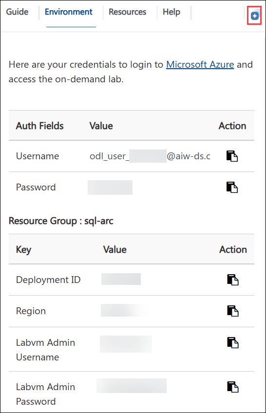
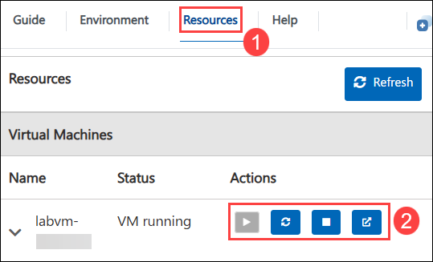
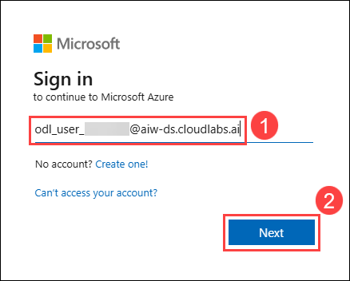
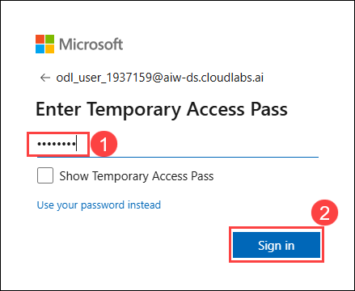
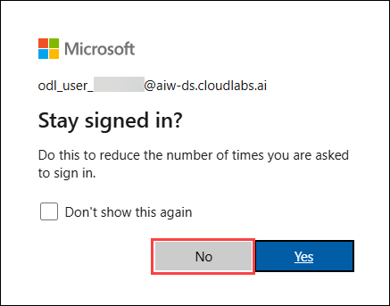
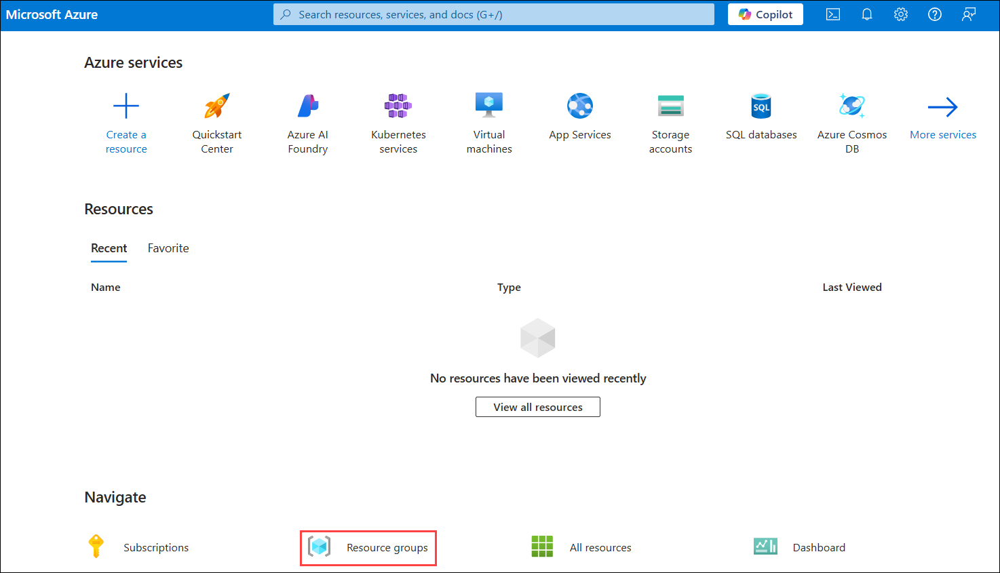
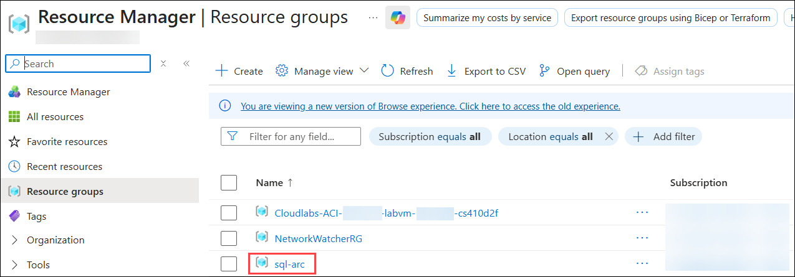

# Azure Arc enabled SQL Servers - Single Pane of Glass

### Overall Estimated Duration: 4 hours

## Overview

Contoso, a global retail company, operates SQL Server databases across various on-premises data centers and remote locations. To streamline management and enhance visibility, Contoso participates in the Azure Arc enabled SQL Servers - Single Pane of Glass. The workshop guides Contoso through the process of connecting its SQL Server instances to Azure Arc, enabling unified management through the Azure portal.

The Azure Arc enabled SQL Servers - Single Pane of Glass demonstrates how to extend Azure management capabilities to SQL Server instances running on-premises or in other cloud environments. By leveraging Azure Arc, you can centrally manage and govern SQL Server deployments with Azure’s tools and services, regardless of their location.

## Objective

Learn to connect standard on-premises SQL Server instances to Azure Arc for centralized management and configure a comprehensive dashboard in Azure Monitor for centralized oversight of all SQL Server instances via Azure Arc.

1. **Onboard the On-prem SQLServer to Azure Arc-enabled SQL Server:** Connects on-premises SQL Server instances to Azure Arc for centralized management. Participants will successfully connect their on-premises SQL Server instances to Azure Arc, enabling centralized management and visibility from the Azure portal.

1. **Onboard the On-prem SQLServer 2016 to Azure Arc-enabled SQL Server:** Integrates SQL Server 2016 with Azure Arc, ensuring compatibility with older SQL Server versions. Participants will integrate SQL Server 2016 with Azure Arc, allowing them to manage and monitor older SQL Server instances through Azure’s management tools.

1. **Create a Single pane of glass-managed solutions with Azure Arc:** Configures a unified management dashboard in Azure to oversee all SQL Server instances from a single interface. Participants will configure a unified management dashboard in Azure, providing a comprehensive view and control over all their SQL Server instances from a single, centralized interface.

## Prerequisites

Participants should have:

- **Basic Knowledge of SQL Server:** Familiarity with SQL Server concepts and management tasks.
- **Understanding of Azure Services**: Awareness of Azure services and how Azure Arc integrates with on-premises resources.
- **Networking Basics:** Understanding of networking principles to ensure connectivity between on-premises servers and Azure.

## Architecture

To complete these exercises, Azure Arc is used to extend Azure's management capabilities to both standard and legacy on-premises SQL Server instances, enabling them to be managed from the Azure portal. Azure Monitor provides essential performance metrics, logs, and alerts for these SQL Server instances, facilitating effective monitoring and troubleshooting. Additionally, Azure Monitor Dashboards are utilized to create a unified, customizable view of all connected SQL Server instances, consolidating monitoring data into a single interface for streamlined management and oversight.

## General Architecture Diagram

 

## Explanation of Components

The architecture for this lab involves several key components:

- **Azure Arc:** Extends Azure's management and governance capabilities to on-premises, multi-cloud, and edge environments, enabling unified management, consistent policy enforcement, and centralized monitoring across diverse infrastructure.
- **Virtual Machine:** A virtual machine running on Hyper-V that hosts workloads or applications on-premises.
- **Azure Resource Manager:** This is for registering and managing resources within the Azure portal.
- **Azure Monitor:** Provides performance metrics, logs, and dashboards for unified monitoring and management of SQL Server instances onboarded to Azure Arc.

## Getting Started with the Lab
 
Welcome to your Azure Arc-enabled SQL Servers - Single Pane of Glass workshop! We've prepared a seamless environment for you to explore and learn about Azure services. Let's begin by making the most of this experience:

## Accessing Your Lab Environment
 
Once you're ready to dive in, your **Virtual Machine** and **Guide** will be right at your fingertips within your web browser.

## Virtual Machine & Lab Guide

Your virtual machine is your workhorse throughout the workshop. The lab guide is your roadmap to success.

## Exploring Your Lab Resources
 
To get the lab environment details, you can select the **Environment** tab. Additionally, the credentials will also be emailed to your registered email address.

 
## Utilizing the Split Window Feature
 
For convenience, you can open the lab guide in a separate window by selecting the **Split Window** button from the top right corner.
 

 
## Managing Your Virtual Machine
 
Feel free to **Start, Stop, or Restart (2)** your virtual machine as needed from the **Resources (1)** tab. Your experience is in your hands!

## Lab Guide Zoom In/Zoom Out

To adjust the zoom level for the environment page, click the **A↕ : 100%** icon located next to the timer in the lab environment.

  
 
## Let's Get Started with Azure Portal
 
1. On your virtual machine, click on the **Azure Portal** icon as shown below:
 
   

1. On the **Sign in to Microsoft Azure** tab, you will see the login screen. Enter the following **email/username**, and click on **Next**. 

   * **Email/Username:** <inject key="AzureAdUserEmail"></inject>
   
      
     
1. Now enter the following **password** and click on **Sign in**.
   
   * **Password:** <inject key="AzureAdUserPassword"></inject>
   
      

1. If prompted to stay signed in, you can click **No**.

   

1. Now you will see the **Azure Portal** dashboard, then click on **Resource groups** from the **Navigate** panel to see the **Resource groups**.

   
   
1. Confirm that you have all **Resource groups** present as shown below.

   
   
By completing these exercises, participants will gain the skills to connect and manage both standard and legacy on-premises **SQL Server** instances using **Azure Arc**, allowing for centralized oversight through Azure. They will learn to onboard **SQL Server** instances, including **SQL Server 2016**, and create a unified management dashboard using **Azure Monitor**, providing a comprehensive view and control over their entire SQL Server environment from a single interface.

## Support Contact
 
The CloudLabs support team is available 24/7, 365 days a year, via email and live chat to ensure seamless assistance at any time. We offer dedicated support channels tailored specifically for both learners and instructors, ensuring that all your needs are promptly and efficiently addressed.

Learner Support Contacts:
- **Email Support**: cloudlabs-support@spektrasystems.com
- **Live Chat Support**: https://cloudlabs.ai/labs-support

Now, click on **Next>>** from the lower right corner to move on to the next page.

### Happy Learning!!
